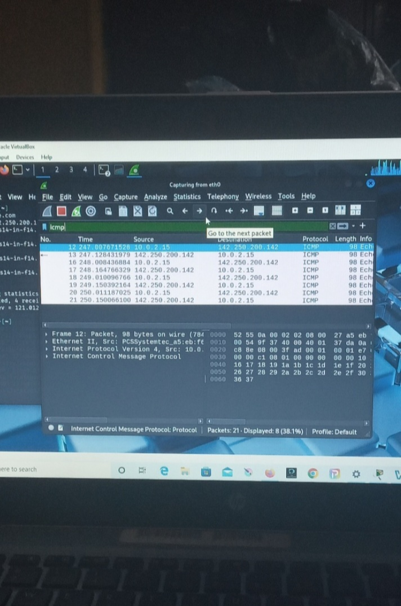

# ICMP Taffic capture (Wireshark)
Analyzed live traffic between a local host and a remote Google server
Successfully captured echo requests and echo reply packets

---
## Peer-to-Peer connectivity (Packet Tracer)
Connecting two identical PCs using the correct physical cabling
Identical devices speak on the same physical pins (TX). A standard cable causes a collision because it connects "Mouth to mouth"

The fix: Use a crossover cable to phisically swap the internal wires so one PCs speak hits the others listen.

---
### MAC Spoofing(lab 03)
Objective: Successfully modified the hardware identifier (MAC Address) of a network interface using macchanger.
